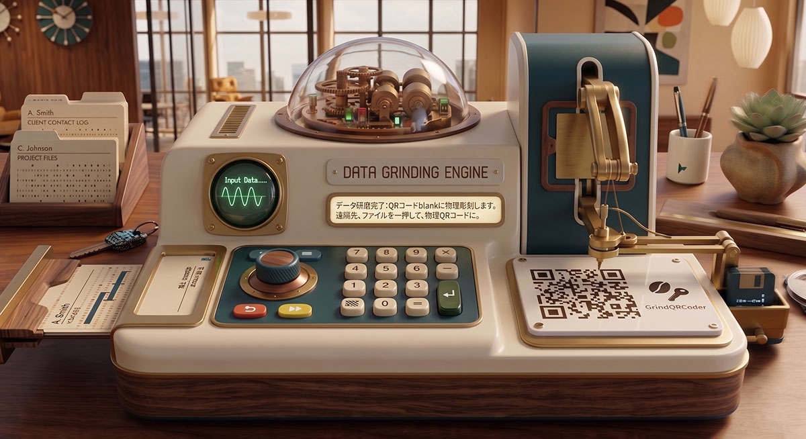

# QR Coder 📱

**完全オフラインで動作する、プライバシーファーストの高機能QRコードジェネレーター。**

**QR Coder** は、URL、Wi-Fi設定、SNSプロフィールなど、あらゆる共有リンクを高品質なQRコードに瞬時に変換するアプリケーション（PWA）です。
入力されたデータや設定履歴はすべてブラウザの IndexedDB にローカル保存されるため、外部へのデータ通信を必要とせず、完全なオフライン環境で動作します。

## 哲学と特徴 (Philosophy & Features)

### 1. プライバシー・バイ・デザイン (No SaaS, No Subscriptions)
本アプリケーションは、ユーザーのデータを外部サーバーへ一切送信しません。
機能を純粋なQRコード生成に特化させることで、セキュアで軽量な動作環境を実現し、ユーザーのデータプライバシーを完全に保護します。
**ソースコードはオープンソースとして公開されており、高い透明性と安全性が担保されています。**

### 2. オフラインファースト・アーキテクチャ (PWA)
サーバーサイドの処理や外部データベースへの依存はありません。
一度ブラウザから「アプリとしてインストール」を行うことで、必要なリソースがすべて端末にキャッシュされます。ネットワーク接続が一切ない環境でも、遅延なく瞬時に起動・動作します。

### 3. 洗練されたデザインと品質管理 (Advanced Design & Quality Control)
- **高度なカスタマイズ:** グラデーションカラー、ドットや四隅の形状変更、ロゴの配置、「SCAN ME」などのカスタムフレームの追加が可能です。
- **QRコード品質スコア:** コントラスト比の不足や、ロゴによるデータ欠損率、URLの長さをリアルタイムで判定し、読み取りエラー（事故）を未然に防ぐ品質チェック機能を搭載しています。
- **洗練されたUX:** デバイス特有の挙動（iOSのズームバグなど）を防止し、高品質なフォーカスリングや滑らかなアニメーションなど、ネイティブアプリに匹敵する操作感を提供します。

### 4. 強固な暗号化とシームレスなファイル管理
OSのローカルにあるデータベースファイル（`.qrcoder`）をブラウザから直接読み書きします。OS上でファイルをダブルクリックするだけでアプリが起動し、自動でデータを読み込みます（File Handling API）。
保存時には Web Crypto API を用いた `AES-256-GCM` による強力な暗号化が施されるため、万が一ファイルが流出してもパスワードがない限り絶対に解読されません。

- **🚨 警告:** パスワードを忘れた場合、暗号化の仕組み上、データの復元は技術的に100%不可能です。パスワードの管理には十分ご注意ください。
- **💡 推奨ブラウザ:** 直接の上書き保存（File System Access API）をフルサポートしている **Chrome** または **Edge** のご利用を強く推奨します（Safari/Firefoxでは毎回ダウンロード保存となります）。

### 5. 洗練されたキーボードナビゲーション (Grind & Polish)
- **コマンドパレット (Cmd+K / Ctrl+K):** マウスを使用せず、データの保存や読み込み、各種設定機能へ瞬時にアクセス可能です。
- **堅牢なフェイルセーフ:** 編集中の未保存状態を即座に検知し、誤ったタブのクローズや操作ミスによるデータロストを未然に防ぎます。

## 使い方 (How to Use)

1. セキュリティの都合上、必ず **HTTPS環境**（GitHub Pages, Vercel等）またはローカルの `localhost` で `index.html` にアクセスしてください。
2. アドレスバーのアイコン、または画面のボタンから、PWAとして「アプリをインストール」します。
3. 以降はPCやスマートフォンのアプリケーションとして完全にオフラインで利用できます。

## ファイル構成 (File Structure)

- `index.html` : UIおよびアプリケーションロジック（Alpine.js, IndexedDB制御, 暗号化機能）を含む本体
- `styles.css` : Tailwind CSS によって生成されたスタイルファイル
- `sw.js` : PWA用の Service Worker（完全オフライン化、キャッシュコントロール）
- `manifest.json` : PWAマニフェスト

## 免責事項 (Disclaimer)

本ソフトウェアは「ローカルファースト」のアーキテクチャを採用しており、データはすべてお使いのPC（またはブラウザのIndexedDB）内に保存されます。
外部サーバーへの自動バックアップは行われないため、PCの故障、ブラウザのキャッシュクリア、予期せぬエラーなどによりデータが消失するリスクがあります。

**本ソフトウェアを使用したことによるデータの消失や、それによって生じた損害について、作者は一切の責任を負いません。**

日々の入力が完了した際は、こまめに保存（Cmd+S / Ctrl+S）を行い、出力された `.qrcoder` ファイルをGoogle DriveやDropboxなどの外部ストレージにバックアップ（退避）することを強く推奨します。

## ライセンス (License)

MIT License
